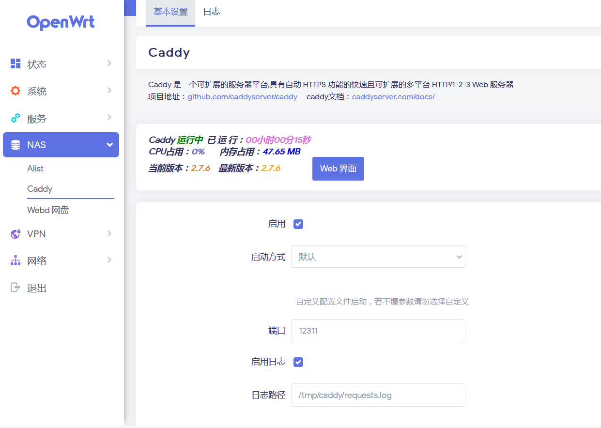
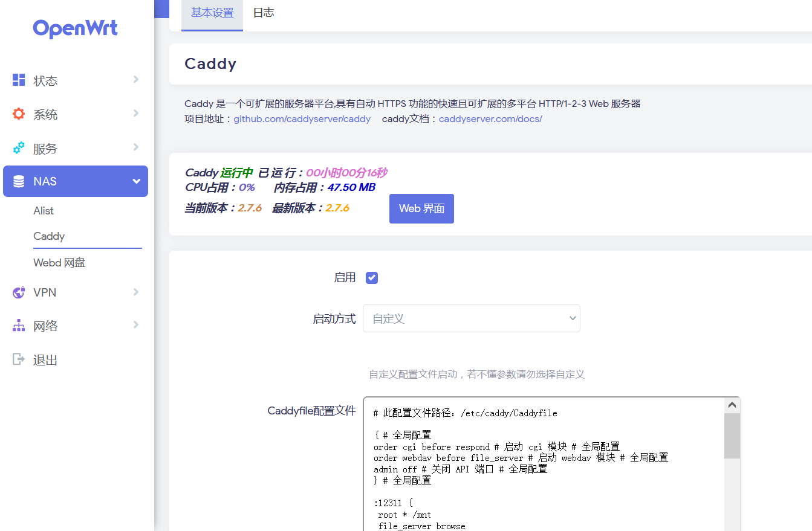

# luci-app-caddy
<p align="center">
<a href="https://github.com/lmq8267/luci-app-caddy/releases">
<a href="https://github.com/lmq8267/luci-app-caddy/graphs/contributors">
<a href="https://github.com/lmq8267/luci-app-caddy/releases/">
<a href="https://github.com/lmq8267/luci-app-caddy/issues">
<a href="https://github.com/lmq8267/luci-app-caddy/discussions">
<a href="GitHub repo size">
<a href="https://github.com/lmq8267/luci-app-caddy/actions?query=workflow%3ABuild">

项目地址：https://github.com/caddyserver/caddy

没有添加caddy二进制程序，需要下载或编译对应cpu架构的二进制程序手动上传至路由器，然后填写对应的程序路径。
caddy的大概 [命令参数](https://github.com/lmq8267/caddy/blob/main/README_caddy.md)
```shell
#查看添加了哪些插件命令
caddy list-modules -s
```
------------------------------------------------------
编译的大概步骤：抄自网上的方法,也有我编译好的二进制文件[caddy](https://github.com/lmq8267/caddy/releases)
```shell
apt update
apt install xcaddy git libnss3 upx-ucl
```

不能安装xcaddy的可以
```shell
go install github.com/caddyserver/xcaddy/cmd/xcaddy@latest
```

```shell
#下载安装go
wget https://go.dev/dl/go1.21.6.linux-amd64.tar.gz
rm -rf /usr/local/go && tar -C /usr/local -xzf go1.21.6.linux-amd64.tar.gz
export PATH=$PATH:/usr/local/go/bin

#编译  需要什么插件自行添加了 以下只添加了caddy-webdav和caddy-cgi
GOOS=linux GOARCH=mipsle GOMIPS=softfloat ~/go/bin/xcaddy build \
    --with github.com/mholt/caddy-webdav \
    --with github.com/aksdb/caddy-cgi/v2 

#编译出来可能体积很大 可以使用upx压缩一下
upx --lzma --best caddy
```

--------------------------------------------------------
### UI预览 ###
我只是用来做文件服务器，所以也就一般配置


其他功能可以自行修改编辑配置文件



