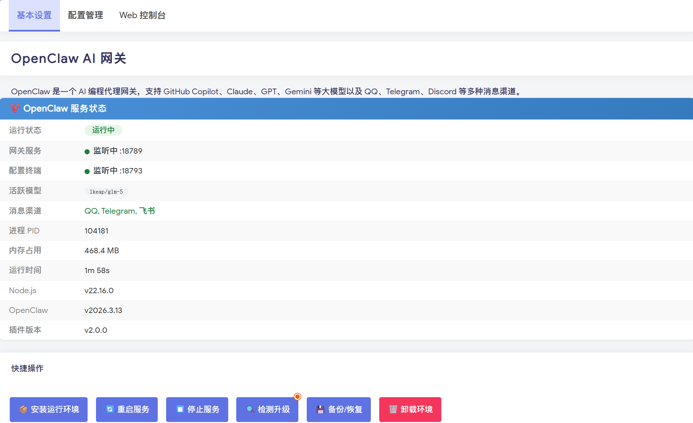

# luci-app-openclaw

[](https://space.bilibili.com/59438380)
[](https://blog.910501.xyz/)
[](https://github.com/10000ge10000/luci-app-openclaw/actions/workflows/build.yml)
[](LICENSE)

[OpenClaw](https://github.com/openclaw/openclaw) AI 网关的 OpenWrt LuCI 管理插件。

在路由器上运行 OpenClaw，通过 LuCI 管理界面完成安装、配置和服务管理。

<div align="center">
  
</div>

**系统要求**

| 项目 | 要求 |
|------|------|
| 架构 | x86_64 或 aarch64 (ARM64) |
| C 库 | musl（自动检测；离线包仅支持 musl） |
| 依赖 | luci-compat, luci-base, curl, openssl-util, tar, script-utils |
| 存储 | **2GB 以上可用空间** |
| 内存 | 推荐 1GB 及以上 |

**当前适配版本**

| 组件 | 默认版本 | 说明 |
|------|----------|------|
| OpenClaw | `2026.5.12` | npm `latest` 稳定标签；不默认追 `2026.5.14-beta.2` |
| Node.js | `22.16.0` | 安装后会按 OpenClaw `engines.node` 做强校验，低于要求会直接失败 |
| 微信插件 | `@tencent-weixin/openclaw-weixin@2.4.3` | CLI 使用 `@tencent-weixin/openclaw-weixin-cli@2.1.4` |

## 📦 安装

### 方式一：.run 自解压包（推荐）

无需 SDK，适用于已安装好的系统。

```bash
# 下载最新版本（自动获取版本号）
VER=$(curl -sI "https://github.com/10000ge10000/luci-app-openclaw/releases/latest" 2>/dev/null | grep -i "location:" | sed 's/.*tag\/v\{0,1\}//' | tr -d '\r\n')
wget "https://github.com/10000ge10000/luci-app-openclaw/releases/download/v${VER}/luci-app-openclaw_${VER}.run"
sh "luci-app-openclaw_${VER}.run"
```

### 方式二：.ipk 安装

```bash
# 下载最新版本（自动获取版本号）
VER=$(curl -sI "https://github.com/10000ge10000/luci-app-openclaw/releases/latest" 2>/dev/null | grep -i "location:" | sed 's/.*tag\/v\{0,1\}//' | tr -d '\r\n')
wget "https://github.com/10000ge10000/luci-app-openclaw/releases/download/v${VER}/luci-app-openclaw_${VER}-1_all.ipk"
opkg install "luci-app-openclaw_${VER}-1_all.ipk"
```

### 方式三：集成到固件编译

适用于自行编译固件或使用在线编译平台的用户。

```bash
cd /path/to/openwrt

# 添加 feeds
echo "src-git openclaw https://github.com/10000ge10000/luci-app-openclaw.git" >> feeds.conf.default

# 更新安装
./scripts/feeds update -a
./scripts/feeds install -a

# 选择插件
make menuconfig
# LuCI → Applications → luci-app-openclaw

# 编译
make package/luci-app-openclaw/compile V=s
```

使用 OpenWrt SDK 单独编译：

```bash
git clone https://github.com/10000ge10000/luci-app-openclaw.git package/luci-app-openclaw
make defconfig
make package/luci-app-openclaw/compile V=s
find bin/ -name "luci-app-openclaw*.ipk"
```


## 🔰 首次使用

1. 打开 LuCI → 服务 → OpenClaw，点击「安装运行环境」
2. 安装完成后服务会自动启动，点击「刷新页面」查看状态
3. 进入「Web 控制台」添加 AI 模型和 API Key
4. 进入「配置管理」可使用向导配置消息渠道

## 自定义安装路径

UCI 字段仍然是 `openclaw.main.install_path`，语义为基础目录。例如：

```bash
uci set openclaw.main.install_path='/mnt/data'
uci commit openclaw
openclaw-env setup
```

实际运行目录会固定展开为 `/mnt/data/openclaw`。如果误填 `/mnt/data/openclaw`，插件会自动规范化为 `/mnt/data`，不会再拼成 `/mnt/data/openclaw/openclaw`。

安装前会执行写入探针；如果 overlay 已满、只读或外置盘未正确挂载，安装会在下载前失败并给出明确日志。

## 微信插件依赖

微信渠道安装前会检查：

- `openclaw` 系统用户是否存在，不存在时自动创建
- `python3` 是否已安装
- npm cache、tmp、OpenClaw 数据目录是否可由 `openclaw` 用户写入
- 旧渠道名 `weixin` 会迁移为 `openclaw-weixin`

如缺少 Python3：

```bash
opkg update
opkg install python3
```

## 已知说明

- OpenClaw 的 diagnostic heartbeat 可能在日志中出现类似周期性探测记录。它不是一次真实用户对话请求；如需降低噪音，优先在 OpenClaw 配置或日志采集侧降低诊断日志级别，不建议直接修改模型调用逻辑。
- 当前仓库提供源码、OpenWrt feeds 集成方式、本地 `.run` / `.ipk` 构建脚本入口；本次维护不自动生成 Release 产物。

## 📂 目录结构

```
luci-app-openclaw/
├── Makefile                          # OpenWrt 包定义
├── luasrc/
│   ├── controller/openclaw.lua       # LuCI 路由和 API
│   ├── openclaw/paths.lua            # 路径规范化与安全校验
│   ├── model/cbi/openclaw/basic.lua  # 主页面
│   └── view/openclaw/
│       ├── status.htm                # 状态面板
│       ├── advanced.htm              # 配置管理（终端）
│       ├── console.htm               # Web 控制台
│       └── wechat.htm                # 微信渠道向导
├── root/
│   ├── etc/
│   │   ├── config/openclaw           # UCI 配置
│   │   ├── init.d/openclaw           # 服务脚本
│   │   └── uci-defaults/99-openclaw  # 初始化脚本
│   └── usr/
│       ├── libexec/                  # 共享 shell helper
│       ├── bin/openclaw-env          # 环境管理工具
│       └── share/openclaw/           # 配置终端资源
├── scripts/
│   ├── build_ipk.sh                  # 本地 IPK 构建
│   ├── build_run.sh                  # .run 安装包构建
│   ├── download_deps.sh              # 下载离线依赖 (Node.js + OpenClaw)
│   ├── upload_openlist.sh            # 上传到网盘 (OpenList)
│   └── build-node-musl.sh            # 编译 Node.js musl 静态链接版本
└── .github/workflows/
    ├── build.yml                     # 在线构建 + 发布
    └── build-node-musl.yml           # Node.js musl 构建
```

## 🤝 贡献

欢迎提交 Issue 和 Pull Request！

## 📄 License

[GPL-3.0](LICENSE)
