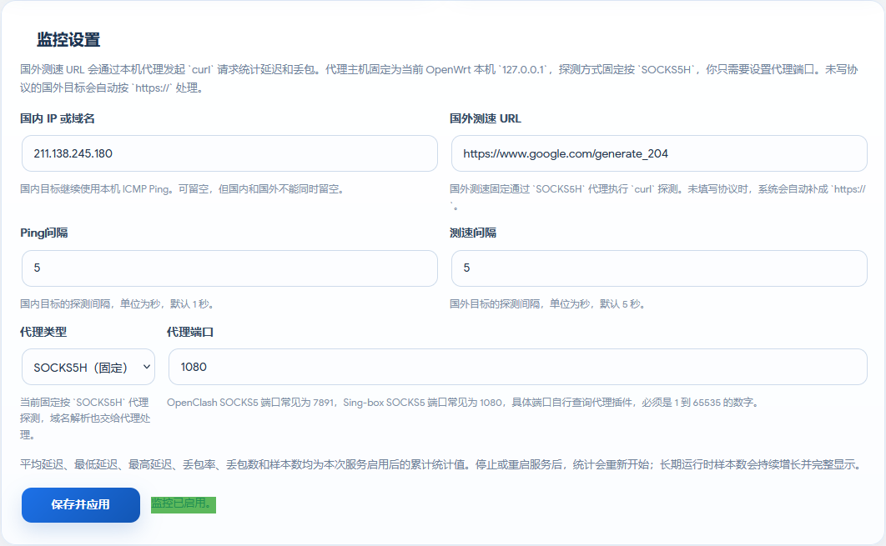
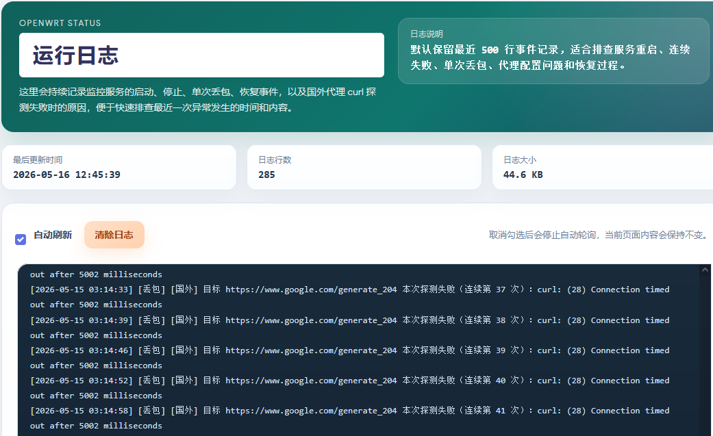

# luci-app-pingpacket

`luci-app-pingpacket` 是一个面向 OpenWrt 的 LuCI 状态监控插件，用于持续观察国内直连质量和国外经代理访问质量，并提供统计、日志和快速排障能力。

## 界面截图

<table>
  <tr>
    <td width="50%" align="center">
      
      <br>
      <sub>监控总览</sub>
    </td>
    <td width="50%" align="center">
      
      <br>
      <sub>监控设置</sub>
    </td>
  </tr>
  <tr>
    <td colspan="2" align="center">
      
      <br>
      <sub>运行日志</sub>
    </td>
  </tr>
</table>

## 适用平台

- OpenWrt 24.10.x，发布 `ipk` 安装包
- OpenWrt 25.12.x，发布 `apk` 安装包
- 已安装 LuCI Web 管理界面
- 设备需具备 `ping`、`curl`、`awk`、`sed`、`grep`、`tail` 等基础命令

当前仓库的 GitHub Actions 工作流默认构建 `x86/64` SDK 版本；插件本身为 LuCI 页面和 shell 脚本，原则上也可移植到其他支持 LuCI 的 OpenWrt 架构。

## 页面位置

后台路径：

`状态 -> Ping丢包监控`

子页面：

- `监控`
- `日志`

## 主要功能

### 监控页

- 支持分别配置国内目标和国外测速 URL
- 国内目标通过本机 `ping` 进行 ICMP 探测
- 国外目标通过 `curl` + `socks5h` 代理进行连续测速，更接近代理实际访问质量
- 国外测速仅将 HTTP `200/204` 视为成功
- 页面内可直接启用或关闭监控服务
- 点击“保存并应用”后会保存配置；如果当前已启用监控，服务会自动重启并按新配置重新开始累计统计
- 当检测到“数据停滞”时，页面会直接显示“重新启动服务”按钮
- 实时显示开始时间、运行时长、最近更新时间、CPU 占用、内存占用和服务状态

### 统计卡片

国内和国外分别独立统计以下数据：

- 平均延迟
- 最低延迟
- 最高延迟
- 丢包率
- 丢包数
- 样本数

统计口径说明：

- 以上数据均为“本次服务启用后的累计统计值”
- 停止服务、重新启用服务或重启服务后，统计会重新开始
- 国内和国外分别独立累计，不合并计算

### 日志页

- 显示插件运行日志
- 顶部支持“自动刷新”开关，默认勾选
- 支持“清除日志”按钮
- 显示日志最后更新时间、日志行数和日志大小
- 默认保留最近 500 行日志

当前日志会记录：

- 服务启动
- 服务停止
- 单次丢包事件
- 恢复事件
- 国外代理测速失败原因

日志规则：

- 只要单次探测失败，就立即记录一条日志
- 连续失败时，每次失败都会单独记录
- 故障后的首次成功响应会记录恢复日志

## 当前探测方式

### 国内

- 目标类型：IP 或域名
- 探测方式：ICMP `ping`
- 默认目标：`www.baidu.com`
- 默认 Ping 间隔：`1` 秒

### 国外

- 目标类型：域名或完整 URL
- 探测方式：通过 `socks5h` 代理发起 `curl` 请求
- 默认测速 URL：`https://www.google.com/generate_204`
- 默认代理端口：`7891`
- 默认测速间隔：`5` 秒
- 代理主机固定为 OpenWrt 本机 `127.0.0.1`

## 配置规则

- 国内和国外目标可以只填其中一个
- 两个目标都为空时，不能“保存并应用”
- 两个目标都为空时，也不能通过开关启用服务
- 若填写国外测速 URL，则必须同时填写代理端口
- 代理端口必须为 `1-65535` 的数字
- 外国测速 URL 未填写协议时，系统会自动按 `https://` 处理
- 页面轮询刷新时，不会覆盖用户正在编辑但尚未保存的输入内容

## 默认配置

安装或补齐配置时，默认值如下：

- 国内目标：`www.baidu.com`
- 国外测速 URL：`https://www.google.com/generate_204`
- 国外代理类型：`socks5h`
- 国外代理端口：`7891`
- 国内 Ping 间隔：`1`
- 国外测速间隔：`5`

默认 UCI 配置示例：

```uci
config pingpacket 'config'
	option enabled '0'
	option domestic_target 'www.baidu.com'
	option foreign_target 'https://www.google.com/generate_204'
	option foreign_proxy_type 'socks5h'
	option foreign_proxy_host '127.0.0.1'
	option foreign_proxy_port '7891'
	option domestic_interval '1'
	option foreign_interval '5'
```

## 依赖

- `luci-base`
- `luci-lua-runtime`
- `luci-compat`
- `curl`

## 安装

### OpenWrt 24.10.x

上传 `ipk` 安装包后执行：

```sh
opkg install luci-app-pingpacket_v1.0.22_all.ipk
```

### OpenWrt 25.12.x

上传 `apk` 安装包后执行：

```sh
apk add --allow-untrusted ./luci-app-pingpacket_v1.0.22_all.apk
```

说明：

- 升级时会尽量保留已有 `/etc/config/pingpacket`
- 若系统中存在历史遗留的 `/etc/config/pingpacket-opkg`，安装脚本会尽量兼容处理

